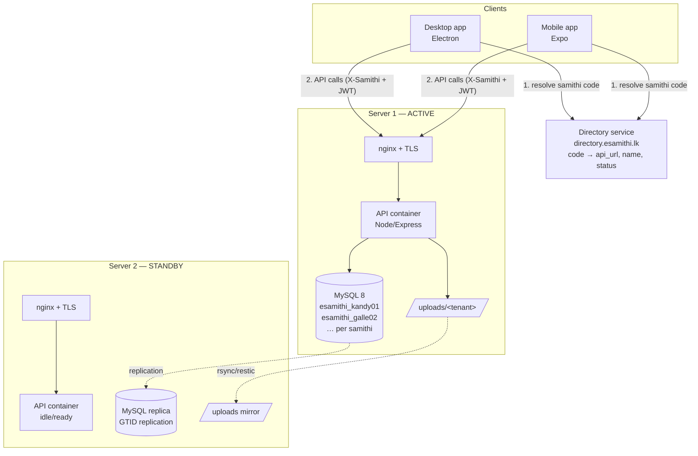
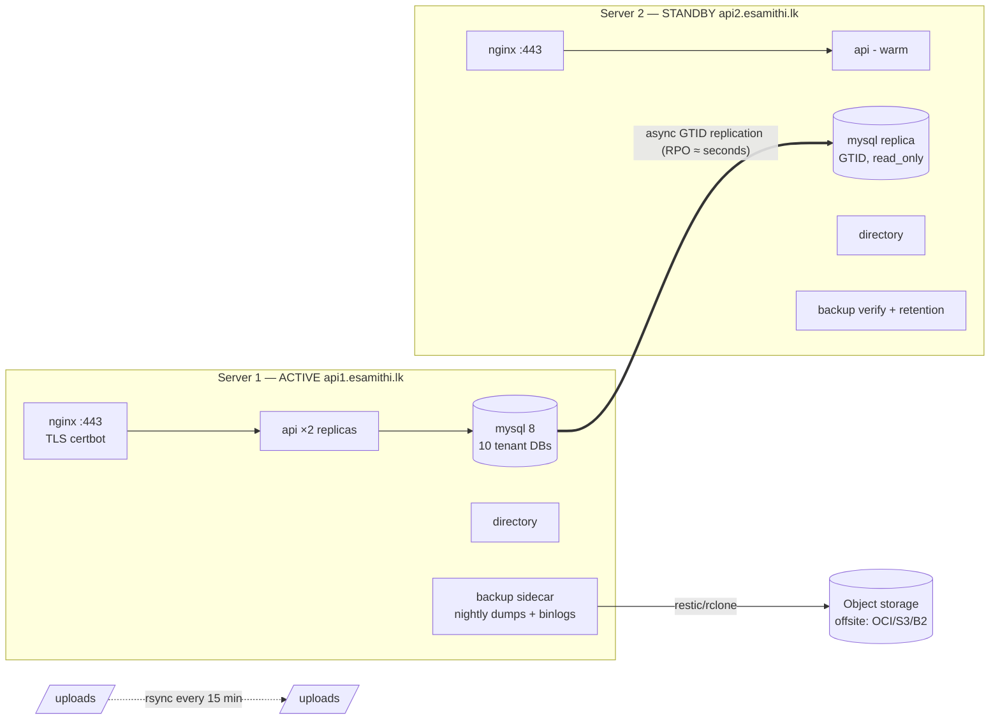
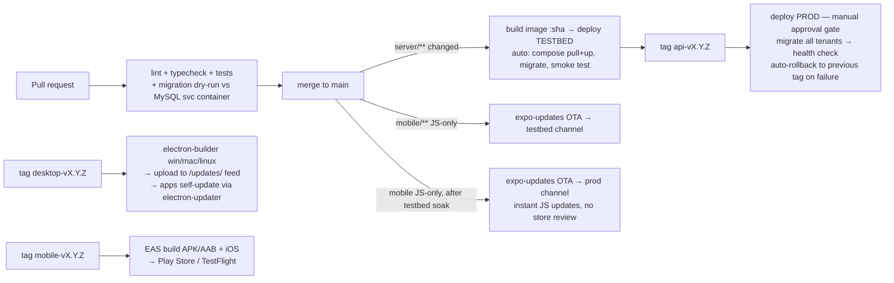

# eSamithi Multi-Samithi Architecture & Deployment Plan

**Version:** 1.0 · **Date:** 2026-07-13 · **Status:** Proposed

---

## 1. Current State (as-built)

```
┌──────────────┐        ┌──────────────┐
│ Desktop app  │        │ Mobile app   │
│ Electron+React│       │ Expo/RN      │
│ staff JWT    │        │ member JWT   │
│ sqlite cache │        │ (typ:member) │
└──────┬───────┘        └──────┬───────┘
       │  HTTP (no TLS!)       │
       ▼                       ▼
   ┌────────────────────────────────┐
   │ nginx → Node/Express (:3000)   │   one VM = one samithi
   │ MySQL: single DB `esamithi`    │   prod: 141.147.75.132
   │ uploads/ on disk               │   testbed: 212.227.103.150
   └────────────────────────────────┘
```

Key facts that constrain the redesign:

- **One API = one samithi.** `server/db.js` creates a single pool to DB `esamithi`. No tenant concept anywhere.
- **API URLs are baked in at build time** — `app.json → expo.extra.apiUrls` (mobile) and `server.config.json` (desktop). Changing servers means rebuilding apps.
- **Auth:** staff JWT (`role` claim) and member JWT (`typ:'member'`, `member_id`), one shared `JWT_SECRET`. Member enrollment = NIC + DOB → PIN. Refresh tokens in `member_refresh_tokens`.
- **Schema management:** `ensureSchema()` runs idempotent ALTERs at boot; `migrations/*.sql` are documentation only. No migration runner.
- **Updates:** desktop via electron-updater generic feed (`http://<ip>/updates/`); mobile via manually distributed APKs.
- **Everything is plain HTTP.** NICs, DOBs and PINs travel in cleartext. This must be fixed as part of this work.

---

## 2. Target Architecture

### 2.1 Decisions

| Decision | Choice | Why |
|---|---|---|
| Tenancy | **Database-per-samithi** (`esamithi_<slug>`), one shared API process | Hard isolation, per-samithi backup/restore/move, ~zero query rewrites (queries already assume "my DB") |
| Tenant routing | **Samithi code + central directory** | One app build for all samithis; directory maps code → server; enables failover without touching clients |
| Runtime | **Docker Compose per server** | Right-sized for 2 servers / 5–10 tenants; image-tag deploys and rollbacks |
| Capacity | 5–10 samithis per server, 2 servers (active + standby/replica) | Matches requirement |

### 2.2 System overview



### 2.3 Tenant model

- Each samithi gets a **slug** (`kandy01`) and a human-friendly **join code** (`KAN-2481`, printed on member letters).
- One MySQL **database per samithi**: `esamithi_kandy01`, each with its own MySQL user (`kandy01_app`, access to only its DB) — defense in depth.
- A server-local registry file (mounted into the API container) declares its tenants:

```jsonc
// /etc/esamithi/tenants.json
{
  "kandy01": { "name": "Kandy Maranadhara Samithi", "db": "esamithi_kandy01", "db_user": "kandy01_app", "status": "active" },
  "galle02": { "name": "Galle Samithi",             "db": "esamithi_galle02", "db_user": "galle02_app", "status": "active" }
}
```

- **Onboarding a new samithi** = script: create DB + user, run all migrations, seed admin user, add to `tenants.json`, add to directory, `docker compose restart api` (or hot-reload on SIGHUP). Target: < 10 minutes.

### 2.4 Directory service (new, tiny)

A ~200-line Node service (or even static JSON behind nginx) deployed on **both** servers, fronted by `directory.esamithi.lk` (DNS with both A records, or a cheap CDN):

```
GET /v1/resolve/KAN-2481
→ { "slug": "kandy01", "name": "Kandy Maranadhara Samithi",
    "api_url": "https://api1.esamithi.lk/api/v1", "status": "active",
    "min_app_version": "1.2.0" }
```

Why it matters:

- One app build serves every samithi, forever.
- **Failover without app updates:** promote Server 2, flip `api_url` in the directory, clients reconnect on next resolve (apps re-resolve on startup and on repeated network failure).
- `min_app_version` gives you a kill switch to force upgrades.
- Clients cache the resolved record; the directory being briefly down never blocks a logged-in user.

### 2.5 API changes (server/)

The beauty of DB-per-tenant: **route handlers don't change.** Only the plumbing:

1. **`db.js` → pool registry.** Replace the single pool with a lazy `Map<slug, Pool>` built from `tenants.json` (per-tenant pools, `connectionLimit: 5` each — 10 tenants × 5 = 50 conns, fine for MySQL 8).

```js
// getPool() becomes getPool(tenantSlug)
function getPool(slug) {
  const t = tenants[slug];
  if (!t || t.status !== 'active') throw new TenantError(slug);
  return pools.get(slug) ?? createPool(t);
}
```

2. **Tenant resolution middleware** (runs before everything):
   - Pre-auth routes (`/auth/login`, `/member-auth/*`): tenant from **`X-Samithi` header** (slug, set by the app after directory resolution).
   - Authenticated routes: tenant from a new **`sam` claim in the JWT** — and it must match the `X-Samithi` header. A token minted for kandy01 can never touch galle02, even if a client misbehaves.
   - `req.tenant = slug`; handlers call `getPool(req.tenant)`.
3. **JWT:** keep one `JWT_SECRET` per server; add `sam: slug` to both staff and member tokens. Member/staff `typ` isolation stays as-is.
4. **Uploads:** `uploads/<tenant>/...`; puruka photo paths become `/api/v1/uploads/<tenant>/<hex>.jpg`.
5. **Push:** unchanged — tokens live in each tenant DB; the announcement route already knows its tenant.
6. **Migrations:** replace boot-time `ensureSchema()` with a real runner (`node migrate.js`) that keeps a `schema_migrations` table and **loops all tenants**. Same SQL files, applied N times. CI calls it on deploy; it must be idempotent and fail-fast per tenant.
7. **Rate limiting:** key auth limiters by `IP + tenant` so one samithi's brute-force lockout doesn't affect others.

### 2.6 Mobile app changes (mobile/)

Login flow becomes:

```
Enter samithi code → directory resolve → (per-samithi) NIC + DOB verify → set/enter PIN
```

- **`src/api/client.ts`:** baseURL comes from the *active samithi profile* (resolved at runtime), not `app.json`. Keep `apiUrls` only as a dev override. Attach `X-Samithi: <slug>` to every request.
- **Multi-samithi accounts:** a member can enroll in several samithis. SecureStore holds a list of profiles: `esamithi.profiles = [{code, slug, name, api_url}]`, refresh tokens keyed per samithi (`esamithi.<slug>.refreshToken`). A samithi-switcher goes in the `more` tab (like account switching in a bank app). React Query cache keys get the slug prefixed (`[slug, 'loans']`) so data never bleeds across samithis on switch.
- **`AuthContext`** becomes profile-aware: active slug + token per profile; session-expiry bounces to that samithi's login only.
- **Push:** registration payload includes nothing new (server knows the tenant), but the app registers its Expo token with **every enrolled samithi**, and notification payloads carry `{slug}` so tapping a notice deep-links into the right samithi context.
- **`photoUrl()`** already derives from API origin — works as-is once the origin is per-profile.
- Remove `usesCleartextTraffic` / `NSAllowsArbitraryLoads` once TLS is live (App Store will eventually force this anyway).

### 2.7 Desktop app changes (src/)

Desktop stays **one samithi per office** (staff tool), so it's simpler:

- **First-run setup screen:** enter samithi code + directory resolve → persist `{code, slug, name, api_url}` in `userData/server.config.json` (replaces hardcoded IPs). A "change samithi" option lives in Settings (admin-only).
- **`api-client.ts`:** baseURL from resolved config; send `X-Samithi` header; re-resolve via directory when the server is unreachable for > N minutes (this is what makes failover transparent).
- **SQLite cache:** file per tenant — `esamithi-<slug>.db` — so switching samithis can't mix cached data.
- **Updater:** point the generic feed at `https://updates.esamithi.lk/desktop/` (served by nginx on both servers, synced). One installer for all samithis.

---

## 3. Deployment Architecture

### 3.1 Topology: active/standby with replication

Two identical VMs (recommend 4 vCPU / 16 GB / 200 GB SSD each — comfortable for 10 tenants):



Why active/standby rather than splitting tenants across both: with 5–10 samithis one server carries the load trivially, and a single active node keeps MySQL writes single-master (no split-brain risk). Server 2 earns its keep as replica + backup verifier + instant failover target. When you outgrow 10 samithis, the directory lets you place tenants 11–20 on a new pair with **zero client changes** — that's the real scaling story.

### 3.2 Docker Compose stack (per server)

```yaml
# docker-compose.yml (server 1; server 2 differs only in mysql role + api scale)
services:
  nginx:
    image: nginx:1.27
    ports: ["80:80", "443:443"]
    volumes: [./nginx:/etc/nginx/conf.d, certs:/etc/letsencrypt, updates:/srv/updates]
  api:
    image: ghcr.io/<org>/esamithi-api:${API_TAG}
    deploy: { replicas: 2 }
    env_file: .env                 # JWT_SECRET, DB creds
    volumes:
      - ./tenants.json:/etc/esamithi/tenants.json:ro
      - uploads:/app/uploads
    healthcheck: { test: ["CMD", "curl", "-f", "http://localhost:3000/api/v1/health"] }
  directory:
    image: ghcr.io/<org>/esamithi-directory:${DIR_TAG}
    volumes: [./directory.json:/data/directory.json:ro]
  mysql:
    image: mysql:8.4
    command: --gtid-mode=ON --enforce-gtid-consistency=ON --log-bin
    volumes: [mysql_data:/var/lib/mysql]
  backup:
    image: ghcr.io/<org>/esamithi-backup:${BK_TAG}   # cron: mysqldump per tenant + restic push
    volumes: [mysql_data:/var/lib/mysql:ro, uploads:/uploads:ro]
```

nginx routes: `/api/` → api upstream (both replicas), `/updates/` → static desktop feed, `directory.` vhost → directory. TLS via certbot (requires a domain — **buy `esamithi.lk` now**; every part of this plan is nicer with real DNS).

### 3.3 Backups (three layers)

| Layer | What | Frequency | Restores |
|---|---|---|---|
| Replication | MySQL GTID async → Server 2 | continuous | whole-server failover, RPO ≈ seconds |
| Logical dumps | `mysqldump` **per tenant DB** + binlogs, restic → offsite object storage | nightly (dumps), 5 min (binlog ship) | single samithi restore, point-in-time |
| Files | `uploads/` rsync to Server 2 + restic offsite | 15 min / nightly | photo recovery |

Retention: 14 daily, 8 weekly, 12 monthly. **Monthly restore drill** (scripted): restore a random tenant dump into a scratch DB on Server 2, run row-count sanity checks, report to ops channel. A backup that's never been restored is a rumor, not a backup.

### 3.4 Failover runbook (target RTO < 15 min)

1. Confirm Server 1 is truly down (health endpoint from 2 vantage points).
2. On Server 2: `mysql> STOP REPLICA; SET GLOBAL read_only=OFF;`
3. `docker compose up -d api` (scale to 2) — same `tenants.json` already in place.
4. Flip `api_url` in directory records to `api2.esamithi.lk` (script: `./failover.sh promote`).
5. Clients re-resolve automatically (on next launch or connection-failure retry). Done.
6. When Server 1 returns, it becomes the new replica; fail back at leisure.

### 3.5 Monitoring (minimum viable)

- Uptime Kuma (or Healthchecks.io) on: `/api/v1/health` per server, directory, MySQL replication lag, backup-job heartbeat, TLS expiry.
- Alerts to WhatsApp/Telegram/email. node-exporter + a Grafana Cloud free tier if you want graphs later.
- Add `/api/v1/health` deep mode: pings every tenant pool, reports per-tenant status.

---

## 4. CI/CD Pipeline

Single monorepo (as today), GitHub Actions, path-filtered workflows. Semver tags per component: `api-v1.4.0`, `desktop-v1.4.0`, `mobile-v1.2.0`.



### 4.1 API (`.github/workflows/api.yml`)

- **PR:** lint, unit tests, boot API against a MySQL service container with 2 fake tenants, run migration runner, hit smoke endpoints. Multi-tenant regression test: *token for tenant A + header for tenant B must 403* — this test is your data-isolation insurance, run on every PR.
- **main → testbed (auto):** build image `ghcr.io/…/esamithi-api:<sha>`, SSH to testbed: `API_TAG=<sha> docker compose pull api && docker compose up -d api && docker compose exec api node migrate.js --all-tenants`, then curl health. 
- **tag → prod (gated):** same steps against Server 1, behind a GitHub Environment with required approval. On failed health check: redeploy previous tag automatically (tags are immutable images — rollback is one variable change).
- Migrations are **expand/contract** (add column → deploy code → drop old column next release) so a rollback never meets an incompatible schema.

### 4.2 Desktop

- Tag `desktop-v*` → matrix build (`windows-latest`, `macos-latest`, `ubuntu-latest`) with electron-builder → upload artifacts + `latest.yml` to `https://updates.esamithi.lk/desktop/` (scp to both servers, or object storage behind the domain).
- electron-updater does the rest: every office PC self-updates on next launch. Change `package.json → build.publish.url` to the new domain.
- Optional but worthwhile: Windows code-signing cert to stop SmartScreen warnings at 10+ offices.

### 4.3 Mobile — two release lanes

| Lane | What changed | Mechanism | Latency |
|---|---|---|---|
| **OTA** | JS/TS only (most releases) | `eas update --channel prod` via expo-updates | minutes, no store |
| **Binary** | native deps / Expo SDK bump | `eas build` → Play Store / TestFlight | days (store review) |

Add `expo-updates` to the app, channels `testbed` and `prod` mapped to EAS branches. `runtimeVersion: { policy: "fingerprint" }` keeps OTA updates compatible with installed binaries automatically. Because the samithi is resolved at runtime, **one binary + one OTA stream serves all samithis** — releasing to 10 samithis is exactly as hard as releasing to 1.

### 4.4 Config & secrets

- GitHub Environments: `testbed`, `prod` (approval required). Secrets: SSH deploy keys, `JWT_SECRET`s, DB root creds, EAS token, signing certs.
- `tenants.json` + `directory.json` live in a small private `esamithi-infra` repo; a workflow pushes them to servers on change (onboarding a samithi = one PR).

---

## 5. Migration Plan (phased, each phase shippable)

| Phase | Work | Risk |
|---|---|---|
| **0. Foundations** (do first) | Buy domain, DNS, TLS on both envs; Dockerize current single-tenant stack; stand up Compose on testbed; set up GitHub Actions CI for existing code | Low — no behavior change |
| **1. Tenant plumbing** | Pool registry + tenant middleware + `sam` JWT claim + migration runner; existing samithi becomes tenant #1 (`esamithi` → `esamithi_<slug>` rename); isolation regression tests | Medium — core change, but handlers untouched |
| **2. Directory + clients** | Directory service; mobile samithi-code login + profile switcher; desktop first-run setup; remove hardcoded IPs | Medium |
| **3. HA + backups** | Server 2: replication, uploads sync, backup sidecar + offsite, failover script, monitoring, restore drill | Low |
| **4. Release machinery** | expo-updates OTA lanes, desktop feed on domain, prod approval gates, onboarding script for new samithis | Low |
| **5. Onboard samithis 2..N** | Run the script, print join codes, go | — |

Suggested order of effort: Phase 0+1 ≈ 2–3 weeks, Phase 2 ≈ 2 weeks, Phases 3–4 ≈ 1–2 weeks combined.

---

## 6. Security hardening checklist (bundled into phases above)

- [ ] TLS everywhere; drop `usesCleartextTraffic` / `NSAllowsArbitraryLoads`
- [ ] `sam` claim enforcement + cross-tenant 403 tests in CI
- [ ] Per-tenant MySQL users (no shared app credential)
- [ ] Per-tenant rate-limit keys
- [ ] Encrypted offsite backups (restic = encrypted by default)
- [ ] Rotate `JWT_SECRET` procedure documented (tokens are ≤ 24 h/15 min — rotation is a same-day event)
- [ ] fail2ban + SSH key-only on both servers; MySQL not exposed publicly (replication over WireGuard or SSH tunnel between the two servers)

---

## 7. What this buys you

- **One codebase, one build, N samithis** — mobile, desktop, and server all release once for everyone.
- **A new samithi onboards in minutes**, not a new server deployment.
- **A dead server is a 15-minute directory flip**, not a rebuild.
- **A corrupted samithi restores alone** without touching its 9 neighbors.
- **Releases are boring:** merge → testbed auto-deploys → tag → approve → prod, with automatic rollback. Mobile JS fixes reach every phone in minutes via OTA.
