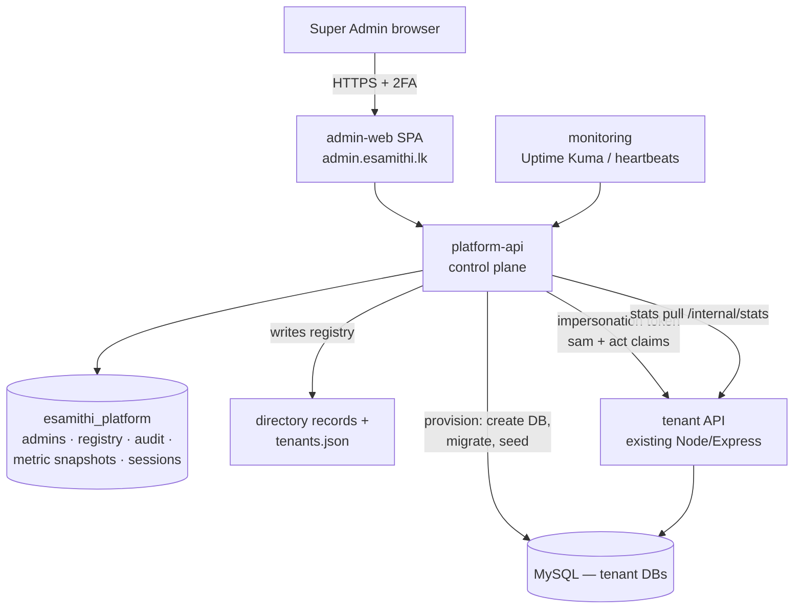

# eSamithi Super Admin Panel — Requirements & Architecture

**Version:** 1.0 · **Date:** 2026-07-13 · **Status:** Proposed
**Depends on:** `MULTI-SAMITHI-ARCHITECTURE.md` (multi-tenant platform, directory service, DB-per-samithi)

---

## 1. Purpose & Scope

A web-based **platform operator console** at `admin.esamithi.lk` for the eSamithi operator (you) to run the whole fleet: onboard and manage samithis, see platform-wide statistics, monitor server/backup health, and — when a samithi needs help — enter any samithi's production environment with **full, audited control**.

**In scope:** platform dashboard, samithi lifecycle management, audited impersonation into any tenant, cross-samithi reporting, staff-user administration, broadcast announcements, directory/failover control, release visibility, audit log.
**Out of scope (future):** billing/subscriptions, samithi self-signup, multi-operator organizations.

### Actors

| Actor | Description |
|---|---|
| **Super Admin** | Platform owner. Full control: manage samithis, impersonate, failover, releases. |
| **Operator** | Support staff (future). Same visibility, impersonation only with per-samithi grant, no destructive platform actions. |
| **Auditor (read-only)** | Can view everything incl. audit log; can change nothing. |

---

## 2. Functional Requirements

Priorities: **M** = Must have, **S** = Should have, **C** = Could have (MoSCoW).

### FR-1 · Authentication & Access

| ID | Requirement | Pri | Acceptance criteria |
|---|---|---|---|
| FR-1.1 | Separate super-admin login (email + password), completely independent from samithi staff/member auth | M | Staff or member credentials/tokens are rejected by the panel and platform API |
| FR-1.2 | Mandatory TOTP 2FA (authenticator app) for every super-admin account | M | Login without a valid TOTP code is impossible; recovery codes issued at setup |
| FR-1.3 | Short sessions: access token ≤ 15 min, refresh ≤ 12 h, absolute logout after 12 h idle | M | Expired session returns to login; refresh rotation with reuse detection |
| FR-1.4 | Role-based access: `superadmin`, `operator`, `auditor` | S | Auditor receives 403 on any mutating endpoint |
| FR-1.5 | Optional IP allowlist for the panel | C | Requests from non-listed IPs rejected at nginx |

### FR-2 · Platform Dashboard

| ID | Requirement | Pri | Acceptance criteria |
|---|---|---|---|
| FR-2.1 | Headline counters: samithis (active / suspended / total), total registered members, members with mobile app enrolled (PIN set), total staff users | M | Numbers match per-tenant queries; refreshed at least hourly + on-demand refresh button |
| FR-2.2 | Financial aggregates across the fleet: total wallet balances, active loans (count + outstanding principal), fixed deposits (count + value), monthly income/expense totals | M | Per-samithi figures sum to the displayed totals; values shown in LKR |
| FR-2.3 | Growth charts: members, loans, and app enrollments over time (per samithi and fleet-wide, 12-month view) | S | Chart matches nightly snapshot data |
| FR-2.4 | Activity feed: recent notable events per samithi (new samithi onboarded, announcement posted, unusual inactivity) | S | Feed items link to the samithi detail page |
| FR-2.5 | "Samithis at a glance" table: name, code, member count, last activity date, app version adoption, health, sortable/filterable | M | One row per samithi; stale samithis (no activity > 30 days) visually flagged |

### FR-3 · Samithi Lifecycle Management

| ID | Requirement | Pri | Acceptance criteria |
|---|---|---|---|
| FR-3.1 | Onboard-samithi wizard: name (EN/SI), slug, auto-generated join code, target server, seed admin account → creates tenant DB, runs all migrations, seeds admin, updates `tenants.json` + directory | M | New samithi reachable from desktop/mobile apps within 10 minutes, no SSH needed |
| FR-3.2 | Edit samithi profile: display name, contact details, join code regeneration | M | Regenerated join code invalidates the old one in the directory |
| FR-3.3 | Suspend / reactivate a samithi | M | Suspended tenant: all API calls return a clear "samithi suspended" error; directory status reflects it; data untouched |
| FR-3.4 | Decommission: final full export (SQL dump + uploads archive) then archive tenant | S | Export downloadable; tenant removed from routing; data retained per retention policy |
| FR-3.5 | Per-samithi backup/restore controls: trigger on-demand backup, view backup history, restore to scratch DB | S | On-demand dump appears in backup storage; restore drill result visible |
| FR-3.6 | Move samithi to another server (when fleet grows beyond one pair) | C | Dump → restore → directory flip, documented as a guided runbook in the panel |

### FR-4 · Per-Samithi Detail View

| ID | Requirement | Pri | Acceptance criteria |
|---|---|---|---|
| FR-4.1 | Overview: member count (active/inactive/deceased), wallets + balances, active loans + arrears summary, FDs, last transaction date, pending member requests count | M | Matches what the samithi's own desktop dashboard shows |
| FR-4.2 | Staff user management: list users, create user, reset password, change role, disable/enable | M | Password reset issues a temporary password shown once; action audited |
| FR-4.3 | Member app stats: enrolled members, locked PINs (with unlock action), push token count | S | Unlock clears `pin_locked_until` and `failed_pin_attempts` |
| FR-4.4 | Tenant settings visibility: puruka expiry, loan settings, min app version override per samithi | S | Changes propagate to tenant `settings` table |
| FR-4.5 | Schema/migration status per tenant (which migrations applied, pending) | M | Mismatched tenant flagged red on dashboard |

### FR-5 · Impersonation — "Enter Samithi" (full control)

| ID | Requirement | Pri | Acceptance criteria |
|---|---|---|---|
| FR-5.1 | One-click **Enter Samithi**: platform API mints a time-limited tenant admin token (`role:'admin'`, `sam:<slug>`, `act:'sa:<superadmin_id>'`, TTL 60 min) | M | Token works against all existing tenant staff endpoints with no per-samithi credentials stored anywhere |
| FR-5.2 | **Samithi workspace** inside the panel: full staff functionality against the tenant API — members (add/edit/view), wallets & transactions, loans (issue/repay/void), income/expenses, FDs, reports, announcements, member-request review, events, puruka admin | M | Every operation available in the desktop app is achievable from the workspace (UI may be simpler but complete) |
| FR-5.3 | Persistent visual banner while impersonating: "You are inside <samithi> as Super Admin", with session countdown and exit button | M | Banner cannot be dismissed; exit revokes the token |
| FR-5.4 | Every impersonated write is dual-logged: platform audit log **and** tagged in tenant data (`created_by`/`reviewed_by` style fields record the super-admin actor) | M | Tenant staff can see that a change was made by platform support |
| FR-5.5 | Impersonation sessions listed and revocable (kill switch) | S | Revoked token fails on next request |
| FR-5.6 | Tenant API accepts the impersonation token via the same middleware chain (new `act` claim handling), rejects it after expiry/revocation | M | Cross-tenant test: impersonation token for A is 403 on B |

### FR-6 · Cross-Samithi Reporting

| ID | Requirement | Pri | Acceptance criteria |
|---|---|---|---|
| FR-6.1 | Comparison report: members, loans outstanding, income/expense, growth — side by side across samithis, date-range filter | S | Export as CSV/XLSX |
| FR-6.2 | Fleet financial summary report (monthly), printable PDF | S | Totals reconcile with per-samithi reports |
| FR-6.3 | Inactivity report: samithis with no transactions in N days | S | N configurable |

### FR-7 · Communications

| ID | Requirement | Pri | Acceptance criteria |
|---|---|---|---|
| FR-7.1 | Broadcast announcement to all or selected samithis (creates a tenant announcement + Expo push in each) | S | Appears in each samithi's mobile notices; audited |
| FR-7.2 | Maintenance banner: platform-wide message shown in desktop + mobile apps (served via directory response) | C | Clients display banner without app update |

### FR-8 · Operations & Monitoring

| ID | Requirement | Pri | Acceptance criteria |
|---|---|---|---|
| FR-8.1 | Server health: API health per server, MySQL replication lag, disk usage, TLS expiry, backup-job heartbeats | M | Red/amber/green states; data from monitoring stack + deep health endpoint |
| FR-8.2 | Per-tenant health: deep `/health` pings every tenant pool and reports per-tenant DB status | M | A broken tenant shows red without affecting others |
| FR-8.3 | **Failover control:** guided promote-Server-2 flow (runs the failover runbook steps with confirmations) | S | Directory `api_url` flip executable from the panel; every step audited |
| FR-8.4 | Release visibility: deployed API version per server, desktop version adoption, mobile binary + OTA version adoption | S | Versions collected from health endpoint and client telemetry (app sends version header) |
| FR-8.5 | `min_app_version` kill switch (global and per samithi) | S | Older clients receive upgrade-required response via directory |

### FR-9 · Audit Log

| ID | Requirement | Pri | Acceptance criteria |
|---|---|---|---|
| FR-9.1 | Every super-admin action logged: who, role, action, target samithi, before/after payload, IP, timestamp | M | No mutating platform endpoint lacks an audit entry (enforced in middleware, not per-route) |
| FR-9.2 | Audit log is append-only (no update/delete via any API), searchable and filterable by samithi/actor/action/date | M | Attempted tampering has no endpoint; DB user for the app has no DELETE on `audit_log` |
| FR-9.3 | Impersonation start/end events logged with session ID linking all actions taken during it | M | Filtering by session ID shows the complete trail |
| FR-9.4 | Audit retention ≥ 7 years, included in offsite backups | M | Verified in backup restore drill |

---

## 3. Non-Functional Requirements

| ID | Requirement | Pri |
|---|---|---|
| NFR-1 | **Security:** HTTPS only; 2FA mandatory; platform JWT secret distinct from tenant server secrets; impersonation tokens ≤ 60 min; secrets in env/secret store, never in the repo | M |
| NFR-2 | **Isolation:** the platform API is the *only* component with cross-tenant reach; the panel never talks to MySQL directly; a compromised tenant cannot reach the control plane | M |
| NFR-3 | **Availability:** panel + platform API deployed on both servers (same active/standby model); dashboard degrades gracefully if a tenant is down | S |
| NFR-4 | **Performance:** dashboard loads < 2 s using cached snapshots; on-demand refresh across 10 tenants < 30 s | S |
| NFR-5 | **Usability:** responsive (usable on a phone for emergency ops); English UI first, Sinhala later | S |
| NFR-6 | **Auditability:** see FR-9; additionally all platform API access logs retained 90 days | M |
| NFR-7 | **Deployability:** ships as two containers (platform-api, admin-web) in the same Compose stack and CI/CD pipelines as everything else | M |
| NFR-8 | **Data freshness:** statistics snapshots nightly (fleet history) + hourly (counters); real-time queries only on samithi detail pages | S |

---

## 4. Architecture

### 4.1 The control plane

The multi-samithi plan already introduced a directory service. The super admin panel grows this into a proper **control plane**, cleanly separated from the tenant-serving **data plane**:



Components:

| Component | What it is |
|---|---|
| **admin-web** | React SPA (Vite), served by nginx at `admin.esamithi.lk`. Reuses desktop app's component patterns/i18n. |
| **platform-api** | New Node/Express service. Owns super-admin auth, registry, provisioning, metrics collector, audit log, impersonation token minting. Absorbs the directory service (directory endpoints become its public, unauthenticated subset). |
| **esamithi_platform** | Control-plane MySQL database (lives beside tenant DBs, replicated + backed up the same way). |
| **Tenant API changes** | Small: accept `act` claim, add `/internal/stats` (auth: platform-signed token), suspended-tenant check in tenant middleware. |

### 4.2 Impersonation token flow

```
1. Super admin (2FA session) clicks "Enter Kandy Samithi"
2. platform-api: verifies role → writes audit "impersonation_start" →
   mints tenant JWT { role:'admin', sam:'kandy01', act:'sa:3', sid:<session>, exp: +60m }
   signed with the TENANT server's JWT_SECRET (shared with platform-api via env)
3. admin-web samithi workspace calls the normal tenant API with this token
   + X-Samithi: kandy01 — existing staff endpoints just work
4. Tenant middleware: sees act claim → allows admin actions, stamps actor
   "sa:3" into created_by-style columns, honours revocation list
5. Exit / expiry → audit "impersonation_end"
```

Design consequences: no samithi passwords exist for the operator, nothing to leak or rotate; revocation is a platform-side denylist checked by tenant middleware (cached 60 s); the `sid` links every audit row of the session.

### 4.3 Metrics collection

A collector job inside platform-api (node-cron):

- **Hourly:** per-tenant counters via `/internal/stats` (members, enrolled, staff, wallets total, loans count/outstanding, FDs, last activity, pending requests, migration version) → upsert `tenant_stats_current`.
- **Nightly:** append to `tenant_stats_history` (fuels growth charts) after backup window.
- **On-demand:** dashboard refresh button triggers a fleet sweep (parallel, 10 s timeout per tenant; failures shown as stale-with-timestamp, never blocking the page).

### 4.4 Data model (esamithi_platform)

```sql
super_admins        (id, email, name, password_hash, totp_secret, role, is_active, last_login_at, created_at)
sa_refresh_tokens   (id, admin_id, token_hash, expires_at, revoked_at)
samithis            (id, slug, join_code, name_en, name_si, server_id, db_name, db_user,
                     status ENUM(active,suspended,archived), contact_json, min_app_version,
                     onboarded_at, suspended_at)
servers             (id, code, api_url, role ENUM(active,standby), health_url)
impersonation_sessions (id, admin_id, samithi_id, sid, expires_at, revoked_at, created_at)
tenant_stats_current   (samithi_id PK, captured_at, members_total, members_active, members_enrolled,
                        staff_users, wallets_total_cents, loans_active, loans_outstanding_cents,
                        fds_count, fds_value_cents, pending_requests, last_txn_at, migration_version)
tenant_stats_history   (id, samithi_id, snapshot_date, ...same counters, UNIQUE(samithi_id, snapshot_date))
audit_log           (id, admin_id, role, action, samithi_id NULL, sid NULL, payload_before JSON,
                     payload_after JSON, ip, created_at)   -- app user has INSERT/SELECT only
platform_settings   (key, value)
```

### 4.5 Platform API surface (sketch)

```
POST   /pa/v1/auth/login | /auth/totp | /auth/refresh | /auth/logout
GET    /pa/v1/dashboard                      # counters + health summary (cached)
GET    /pa/v1/samithis                       # registry list + stats columns
POST   /pa/v1/samithis                       # onboard wizard (provisions tenant)
GET    /pa/v1/samithis/:slug                 # detail (live + cached stats)
PATCH  /pa/v1/samithis/:slug                 # edit / suspend / reactivate
POST   /pa/v1/samithis/:slug/impersonate     # → { token, expires_at, sid }
DELETE /pa/v1/impersonations/:sid            # revoke
GET    /pa/v1/samithis/:slug/users           # staff users (via tenant API proxy)
POST   /pa/v1/samithis/:slug/users/:id/reset-password
GET    /pa/v1/reports/comparison?from&to
POST   /pa/v1/broadcasts                     # fan-out announcements
GET    /pa/v1/ops/health | /ops/backups | /ops/releases
POST   /pa/v1/ops/failover                   # guided promote flow
GET    /pa/v1/audit?samithi&actor&action&from&to
# public (unauthenticated) — absorbed directory:
GET    /v1/resolve/:joinCode
```

### 4.6 Panel screens

1. **Login** (email/password → TOTP)
2. **Dashboard** — counters, fleet charts, health strip, samithis-at-a-glance table
3. **Samithi list** — search/filter/sort, onboard button
4. **Samithi detail** — overview stats, staff users, member-app stats, settings, migration status, backup history, *Enter Samithi* button
5. **Samithi workspace** (impersonated) — tabbed staff UI: Members / Wallets / Loans / Income–Expenses / FDs / Reports / Requests / Announcements / Events / Puruka — with the red super-admin banner
6. **Reports** — comparison + fleet summary, export
7. **Broadcasts** — compose, target selection, history
8. **Operations** — servers, replication, backups, releases, failover
9. **Audit log** — filterable trail
10. **Settings** — super-admin accounts, roles, platform settings

---

## 5. Deployment & CI/CD Integration

- Two new containers in the existing Compose stack on both servers: `platform-api` (replaces `directory`) and `admin-web` (static, served via nginx `admin.` vhost).
- `esamithi_platform` DB replicates and backs up exactly like tenant DBs (it is just one more database on the same MySQL).
- CI: `platform/**` path filter → same build-image → testbed → tag `platform-vX.Y.Z` → approved prod deploy pipeline as the API. Cross-tenant/impersonation security tests run on every PR: *impersonation token for tenant A must 403 on tenant B; expired/revoked token must 401; auditor role must 403 on writes.*
- Onboarding a samithi no longer edits `tenants.json` by hand: platform-api **generates** it (and directory records) from the `samithis` table and signals the tenant API to reload.

---

## 6. Delivery Phases

| Phase | Scope | Requirements covered | Est. |
|---|---|---|---|
| **A. Control-plane core** | platform-api + DB, super-admin auth with 2FA, registry (read), audit middleware, absorb directory | FR-1, FR-9, parts of FR-3 | 2 wks |
| **B. Dashboard & stats** | collector, `/internal/stats` on tenant API, dashboard + samithi list/detail screens | FR-2, FR-4.1, FR-4.5, FR-8.2 | 2 wks |
| **C. Lifecycle & users** | onboard wizard (provisioning), suspend/reactivate, staff-user management, PIN unlock | FR-3.1–3.3, FR-4.2–4.3 | 2 wks |
| **D. Impersonation & workspace** | token flow, tenant middleware `act` support, workspace tabs (members, loans, wallets first; rest iteratively) | FR-5 | 3 wks |
| **E. Reports, comms, ops** | comparison reports, broadcasts, health/failover/release views | FR-6, FR-7, FR-8 | 2 wks |

Phase A cannot start before Phase 1 of the multi-samithi plan (tenant plumbing) is done; B–E can overlap with samithi onboarding.

---

## 7. Open Questions

1. Should tenant staff **see** support changes distinctly in their UI (e.g. "changed by eSamithi support")? (Recommended: yes — builds trust.)
2. Aggregate financials on the dashboard show real money across societies — should the `auditor` role see amounts or only counts?
3. Broadcast announcements: should samithi admins be able to opt out?
4. Data residency/consent: samithi committee agreement should state that platform support can access data for maintenance (paper agreement per samithi).
